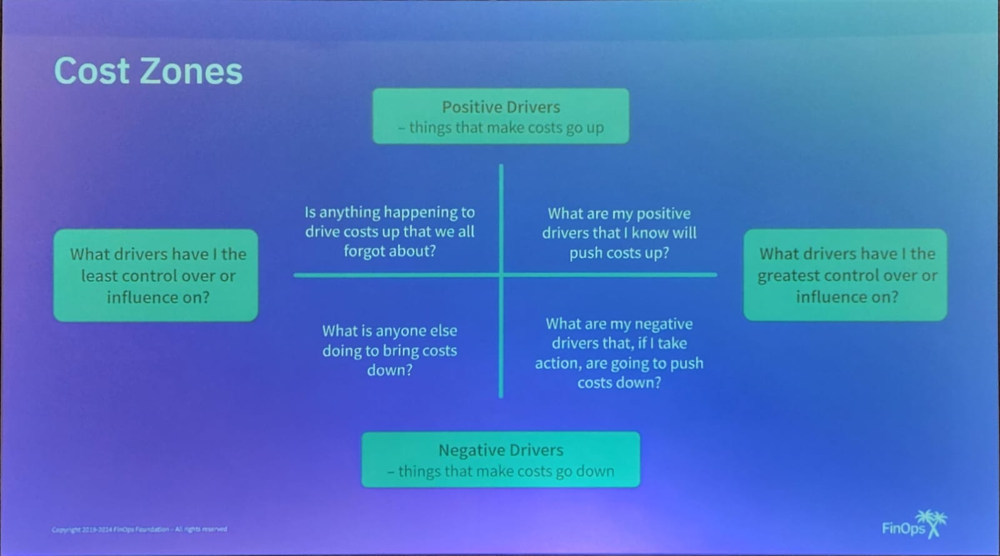
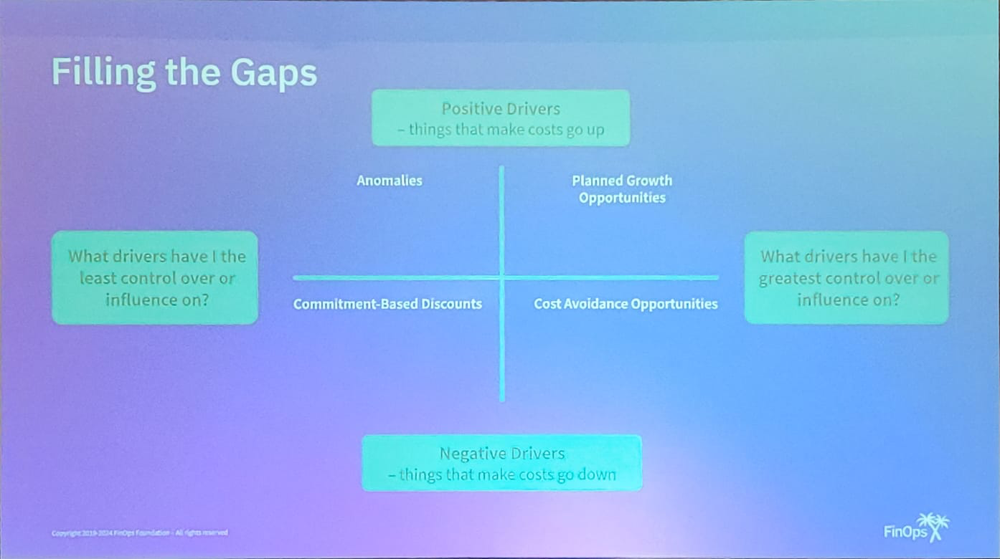
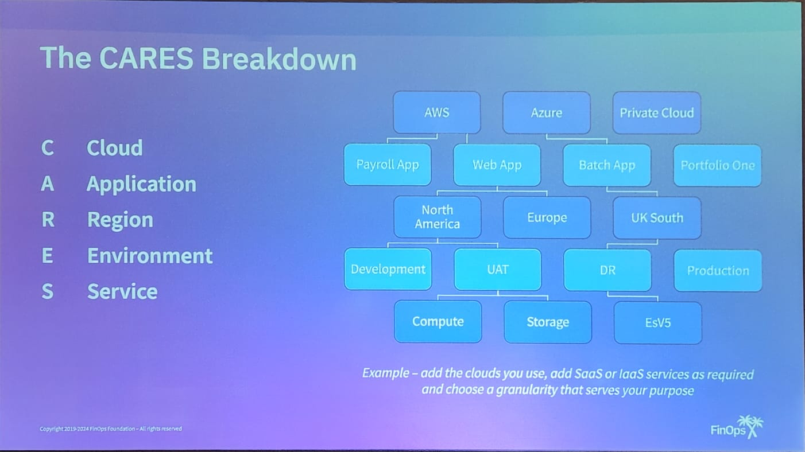
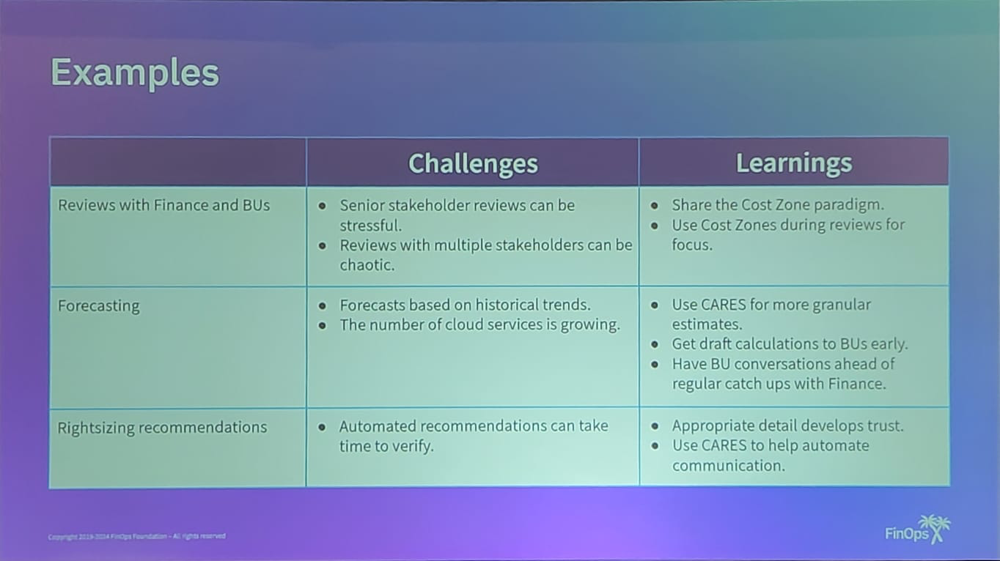

Ian Foster - works for Marsh Mclennan

# First contact and the cbo charter
- We help BUs to manage their own usage, waste, budgets, and forecasts in the public cloud.
- We help march get the best rates on the public cloud assets that they use and services they consume.
- We keep stakeholders connected and informed on matters of FinOps, governance and architecture as they relate to the public cloud and MMCs cloud-first policy.

# Which conversations are hard and why
## Imbalance of expertise
- Do both sides have the same background?
- One side often lacks trust, believing the other doesn't know what they're talking about
## Disagreement
- "You can't tell me what to do"
## Difficult
- Historically or politically difficult (I'm not sure what this means in this context)

# Cost Zones

## Filling the gaps

# The CARES Breakdown

# Examples
