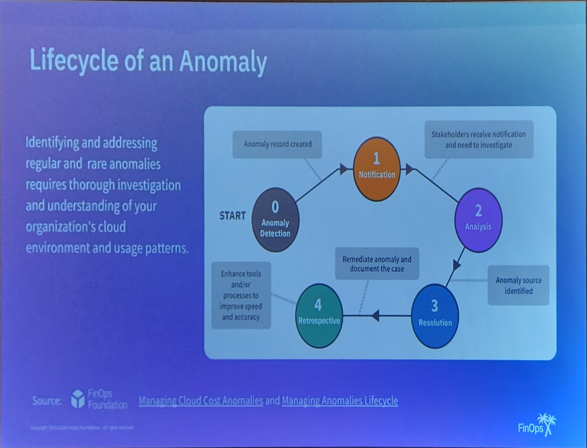
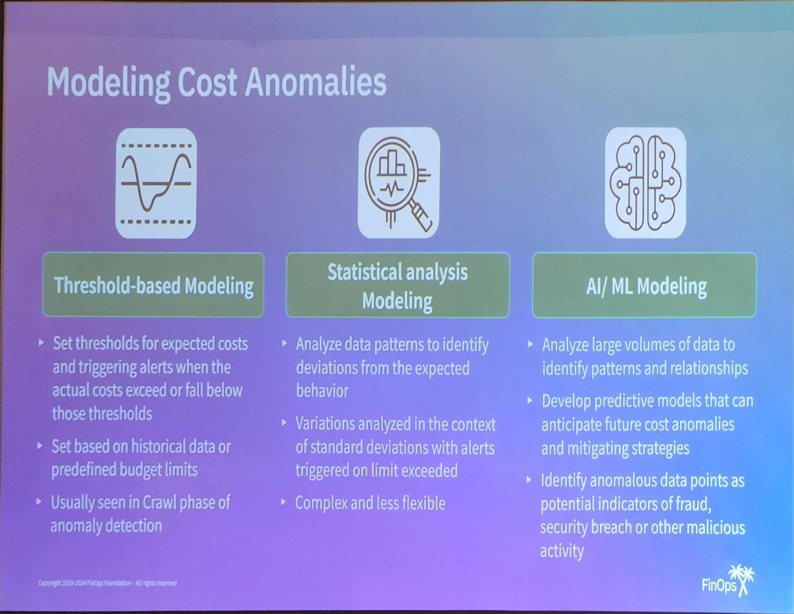
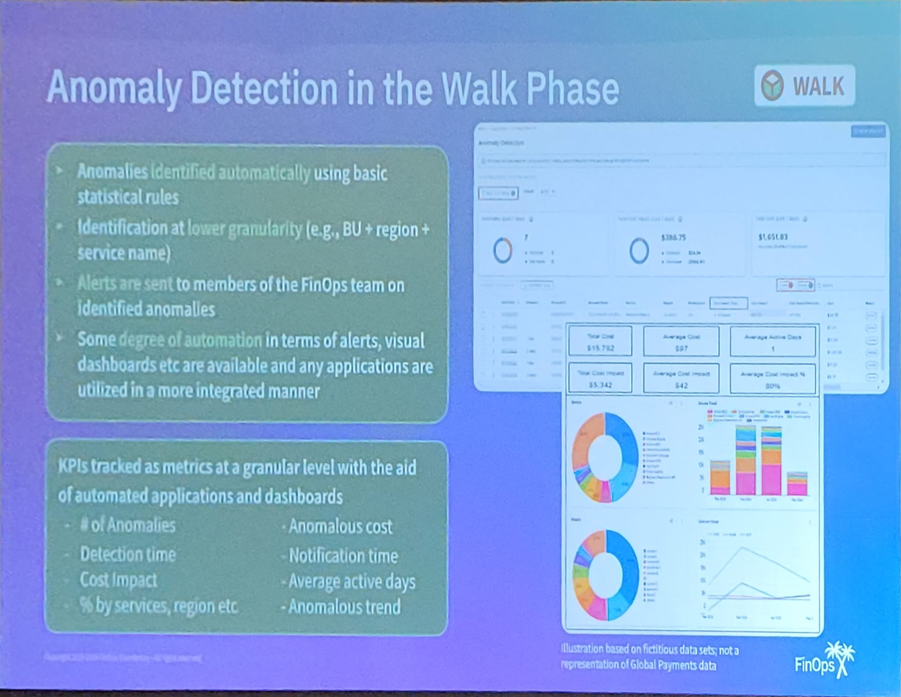
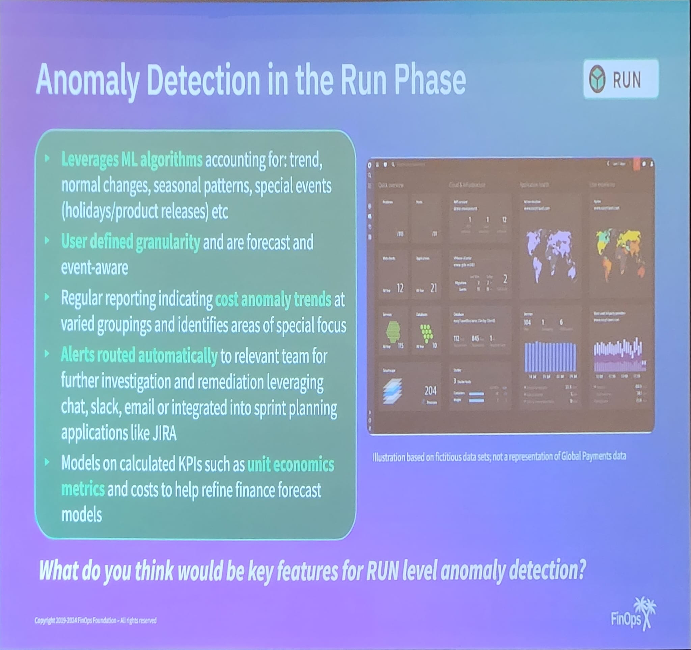

## Anomalies can be routine or a harbinger of bigger issues or events
### Usual suspects
- Misconfigurations
- Unauthorized access
- etc
### Rare anomalies
- Unusual usage during off-hourse/geographical patterns/api calls
- Large data transfer to unknown destinations
- Sudden increase in storage usage
- Extreme burst usage
    - Autoscaling apps don't scale down
- Abnormally low usage despite capacity
- Unexplained account charges

### Lifecycle of an anomaly

### Modeling Cost Anomalies

### Anomaly detection is crawl phase
- Anomalies detected manually using visualisation dashboards and applications
- Manual identification by FinOps team followed by in-depth stakeholder analysis

- KPI's not tracked as metrics but are contextual
    - Cost impact of anomalies
    - Didn't get the other ones :(

### Anomaly detection in the walk phase

### Anomaly detection during run phase

### What you need to lay the ofundation for anomaly detection
- Phase your end goals
- Identify key partners and owners
- Normalize your data
- Leverage tools that will work with your data
- Use a foundation that is dependable wihtout anomalies
- Choose what level is ideal; noise vs too little
- Iterate

# Q&A
- What anomaly tools do they use?
    - CloudHealth
- When they get alerts, how fast do they act?
    - If it's above a certain cost threshold (percentage increse), they will act immediately on it. Otherwise, they create a task and can do it later.