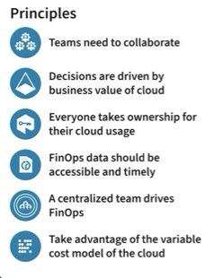
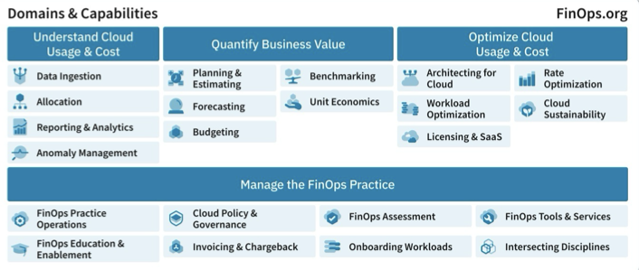

# How to Use FinOps Framework 2024

### Join us for a session on the FinOps Framework 2024, including a closer look at its architecture, capability and domain updates, and examples of the Framework in action.

Domains = values of why you practice FinOps
- Understanding cloud cost & usage
- quantify business value
- optimize cloud usage & cost
- manage the finops practice

Use these as an elevator pitch of what finops does!

### Improvements
Capabilities are compartmentalized 

### Examples in practice
1. planning & estimating vs. forecasting: These are interrelated but diff cadence, triggers, and drivers. 

*meme that was funny that said "I'm a cloud architect I always find a solution"

2. Planning & Estimating vs. Architecting for the cloud
diff cadence, architecting for cloud is constant

3. licensing and SaaS vs. collab w/ ITAM

4. sustainability
Here we're stepping ahead of whats happening instead of totally understanding how it works

5. chargeback vs. manage finops practice

### Framework is meant to be a scaffolding

what are you doing already?

What are your business priorities? focus on those parts of the framework and informatd ignore the capabilities you're not focusing on

#### Copy the framework into team sites (wiki, slack etc) and personalize it!

The framework should be relatable to everything
Functional activities for each and add what you want

Each capability has its own successes 

### Why measures of success?
For the CFO -> R&D vs COGS (cost of goods and services)
CIO -> which workload to move to the cloud? and tech stack improvement

